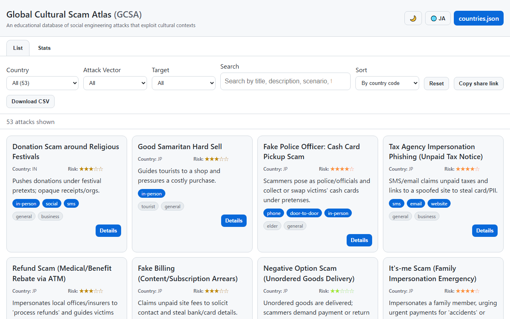
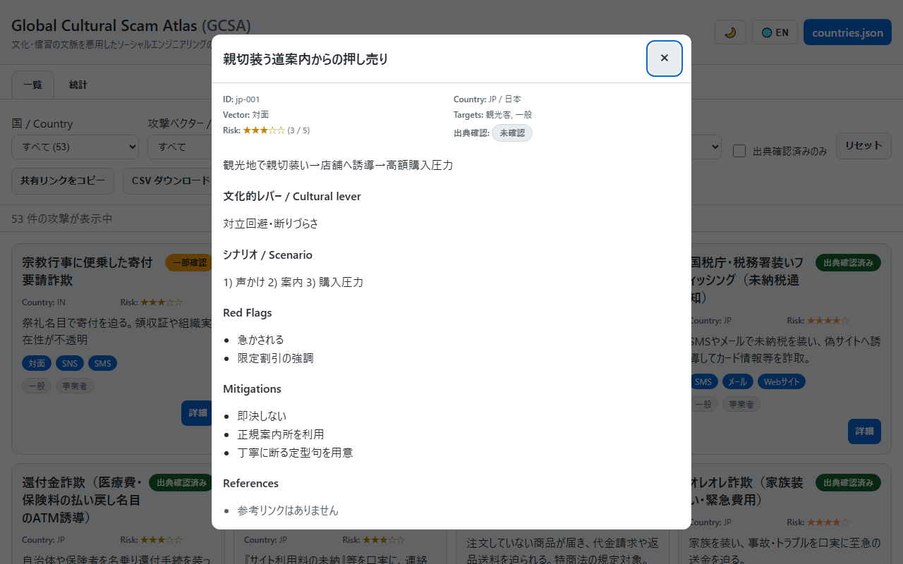
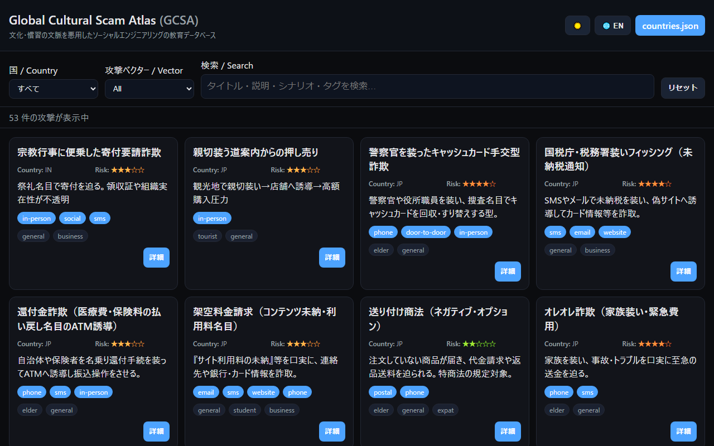
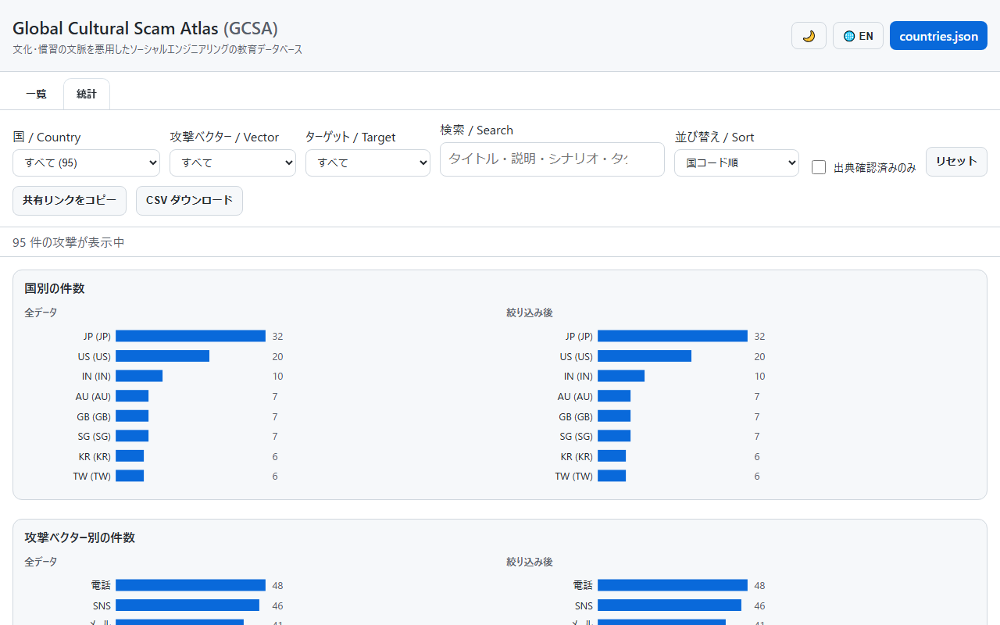

English · [日本語](README.md)

# Global Cultural Scam Atlas (GCSA) - An Educational Database of Culturally-Framed Scams


[](https://ipusiron.github.io/global-cultural-scam-atlas/)

**Day082 - 100 Security Tools with Generative AI**

**Global Cultural Scam Atlas (GCSA)** is an open, educational database of social engineering attacks that exploit cultural and customary contexts observed in different countries. It does not generalise national character; each entry is written from the standpoint of "an attacker could exploit this tendency".

Attacks are stored one JSON per file under `data/attacks/{ISO2}/{id}.json`, aggregated at build time into `dist/countries.json` by GitHub Actions, and served as a dependency-free vanilla-JS UI on GitHub Pages.

---

## 🌐 Demo

👉 **[https://ipusiron.github.io/global-cultural-scam-atlas/](https://ipusiron.github.io/global-cultural-scam-atlas/)**

Open it directly in a browser.

---

## 📸 Screenshots

> 
> *English, light theme, initial view (53 attacks; verification badge on each card).*

> 
> *The detail modal for jp-001 (Red Flags, Mitigations, References with publisher and accessed).*

> 
> *Dark theme.*

> 
> *Statistics tab (country / vector / target / risk / verification-status distribution).*

---

## ✨ Features

- One JSON file per attack, so each contribution is reviewable in isolation.
- JSON Schema validation runs automatically in CI.
- Japanese/English UI switch that also swaps the data labels.
- Filters by country, attack vector, target, and full-text search, plus a sort select and a reset button.
- Search also covers `cultural_lever`, `red_flags`, `mitigations`, and `id`, and each card shows which fields matched.
- Risk score (1-5) displayed as a colour-coded star bar.
- Filter/sort/language state round-trips through the URL hash and has a Copy-share-link button.
- Statistics tab renders country / vector / target / risk histograms (all vs. filtered) as self-contained SVG.
- CSV download exports the current filter result (UTF-8 BOM, CRLF, formula-injection safe).
- Verification status for each entry (verified / partially verified / unverified) shown as a badge on cards and the detail modal.
- A "Verified only" checkbox narrows the list to entries with `verification.status === "verified"` (and round-trips through the URL hash as `verified=1`).
- `tools/check-refs.mjs` checks every reference URL manually (HEAD, falling back to GET); not wired into CI.
- Static site: no external APIs or CDNs are called at runtime.
- The aggregated dataset is publicly available as `dist/countries.json`.

---

## 📖 Usage

### Use the hosted demo

Open the demo page and filter by country, attack vector, target, or keywords. Toggle "Verified only" to limit the list to entries whose `verification.status` is `verified`. Pick a sort order (country code, risk high-first, or id) from the Sort select. Each card lists the search fields where the query hit (title, scenario, Red Flags, ...), and shows a verification badge (Verified / Partially verified / Unverified). The header buttons toggle theme (light/dark) and language (JA/EN). Click "Details" to see Red Flags, Mitigations, and references (with publisher and accessed date) in a modal; backdrop click or Esc closes it and focus returns to the opener.

### List and Statistics tabs

The tabs at the top switch between the List and the Statistics view. The statistics view draws country, vector, target, and risk-score distributions as dependency-free SVG bar charts, side by side for the full dataset and the current filter.

### Share link and URL hash

Filter, sort, and language state is encoded in the URL hash (e.g. `#country=JP&vector=phone&target=elderly&q=ATM&sort=risk&lang=ja`) and restored by browser back/forward. The "Copy share link" button writes it to the clipboard; environments without the Clipboard API fall back to a dialog with a selectable URL.

### CSV download

The CSV button exports the current filter result as UTF-8 (BOM) with CRLF endings. Columns are `id, country, title, vector, targets, risk, cultural_lever, red_flags, mitigations, verification, references`; arrays and reference URL lists are joined with ` / `. Values starting with `= + - @` are prefixed with `'` to defuse spreadsheet formula injection. File name: `gcsa-<country>-<date>.csv`.

### Check reference URLs (manual)

`npm run check:refs` walks every `data/attacks/**` reference URL and sends a HEAD (falling back to GET on 405/501) with ~1 s spacing per host. Exits with code 1 if any 4xx/5xx is seen. External endpoints are flaky, so this script is not wired into CI.

### Combining with Day081

Paste scenario text into Day081's [Emotion-Based Scam Detector](https://ipusiron.github.io/emotion-based-scam-detector/) to practice judging emotional language. GCSA does not yet deep-link scenarios into Day081 because the detector does not currently accept input via URL parameter (see the PR description for details).

### Scaffold a new attack

```bash
node tools/new-attack.mjs JP        # writes data/attacks/JP/jp-033.json at the next free sequence
node tools/new-attack.mjs US 42     # writes us-042.json; refuses to overwrite
```

The scaffold is filled with TODO strings; a human must replace them before `npm run build` and `npm run validate:schema`.

### Override the initial language via URL

Append `?lang=ja` or `?lang=en` to force the initial locale, overriding stored preferences and browser settings. A `lang=` entry inside the URL hash takes precedence over `?lang=`.

### Run locally

Install dependencies, build, and serve `docs/` over HTTP (`file://` cannot `fetch` the JSON, so an HTTP server is required).

```bash
npm install
npm run build:local        # builds dist/countries.json and copies it under docs/dist/
python -m http.server 8000 --directory docs
# open http://localhost:8000/
```

---

## 📐 Screen Layout

| Area | Role |
|------|------|
| Header | Title, theme toggle, language toggle, countries.json download link |
| Tabs | List vs. Statistics switch (`role="tablist"`, `aria-selected`) |
| Filters | Country (with counts), vector, target, full-text search, sort, reset, Copy share link, Download CSV |
| Summary | Current number of visible attacks (announced via `aria-live`) |
| Cards | One card per attack (title, country, risk, vectors, targets, matched fields, details button) |
| Statistics | SVG bar charts for country / vector / target / risk, side by side for all vs. filtered |
| Detail modal | ID, cultural lever, scenario, Red Flags, Mitigations, references (backdrop click and Esc close; focus returns to opener) |
| Toast | Announces share-link copy status via `aria-live` |
| Footer | Link to the GitHub repository |

---

## 🎯 Use Cases

### Education

- In information-literacy or security classes, line up attacks from different countries to see how the same psychological levers (authority, urgency, reciprocity, conformity) wear different cultural clothing.
- In comparative-culture or intercultural-communication classes, use the "cultural lever" field to reverse-lookup customs from each country.

### Work (beyond security)

- Hand out country-filtered summaries during pre-departure training for staff posted or travelling abroad.
- Use entries as source material for travel-agency or study-abroad advisories.
- Help customer-support agents cross-reference incidents reported by non-local users.
- Give cross-border e-commerce or remittance anti-fraud teams a per-country tendency reference.

### Daily life

- Read the entries for your destination before an overseas trip.
- Share with family members going abroad for study.
- Show Japanese scams (JP) in English to foreign friends visiting Japan.

### Hobby and creative work

- Research realistic scam plots for mystery or suspense writing.
- Draw scenario material for escape-room or tabletop games.
- Use the bilingual entries as parallel-text language study material.

### Research

- Classify tactics by attack vector x target x cultural lever.
- Load `countries.json` directly into analysis notebooks.
- Follow the addition history over time to see how trends shift.

### Combinations

- Paste scenario text into Day081's [Emotion-Based Scam Detector](https://ipusiron.github.io/emotion-based-scam-detector/) to practice judging emotional language.
- Share filter URLs with students and trainees so they land on the same country / vector / target selection.
- Load CSV exports into spreadsheets or analysis notebooks (pandas, R, ...) to summarise trends by country and risk.
- Compare the all-vs-filtered histograms in the Statistics tab to see which countries or targets are overweighted at a glance.
- Add your own case as JSON and send a pull request to grow the database (follow `docs/content-guidelines.md`). Scaffold with `tools/new-attack.mjs`.

### Limits

Entries are observations at the time of writing and are not exhaustive. They are not legal advice. Please do not use this project to generalise national character; see `docs/content-guidelines.md`.

---

## 📊 Data Structure

- One attack = one file (`data/attacks/{ISO2}/{id}.json`).
- ID format: `^[a-z]{2}-\d{3}$` (e.g. `jp-001`).
- Aggregated into `dist/countries.json` at build time.
- Structure defined in `data/schema.json` (JSON Schema draft-07).

### Key fields

| Field | Type | Description |
|-------|------|-------------|
| `id` | string | Unique identifier (e.g. `jp-001`) |
| `title` | object | Attack name (`ja`, `en`) |
| `short_desc` | object | Short description (`ja`, `en`) |
| `cultural_lever` | object | Cultural tendency being exploited (`ja`, `en`) |
| `attack_vector` | array | Channel (`in-person`, `phone`, `email`, `sms`, `social`, `website`, `payment-app`, `postal`, `door-to-door`, `marketplace`, `mixed`) |
| `targets` | array | Target type (`tourist`, `elderly`, `student`, `general`, `business`, `expat`) |
| `scenario` | object | Attack flow (`ja`, `en`) |
| `red_flags` | object | Warning signs (`ja`, `en`) |
| `mitigations` | object | Mitigations (`ja`, `en`) |
| `risk_score` | integer | Risk score 1-5 |
| `mediums` | array | Payment channels (`cash`, `credit`, `bank-transfer`, `cryptocurrency`, `gift-cards`, `e-wallet`, `qr-pay`) |
| `legal_notes` | object | Legal notes (`ja`, `en`, optional) |
| `references` | array | Sources (`{label, url, publisher, accessed, quote}`; the last three are optional) |
| `tags` | array | Tags |
| `verification` | object | Verification state (`{status, checked, note}`; `status` is `verified` / `partial` / `unverified`) |

### Current counts

| Country | Attacks |
|---------|---------|
| JP (Japan) | 32 |
| US (United States) | 20 |
| IN (India) | 1 |
| **Total** | **53** |

### Verification status

| Status | Count |
|--------|-------|
| verified | 26 |
| partial | 25 |
| unverified | 2 |
| **Total** | **53** |

---

## 💻 Using the Data

The aggregated `dist/countries.json` is public and does not need an API key.

```javascript
const url = 'https://ipusiron.github.io/global-cultural-scam-atlas/dist/countries.json';
const data = await (await fetch(url)).json();
// Attacks for a specific country
const jp = data.countries.find(c => c.country_code === 'JP').attacks;
// Filter by risk score
const highRisk = data.countries.flatMap(c => c.attacks).filter(a => a.risk_score >= 4);
// Filter by attack vector
const phoneScams = data.countries.flatMap(c => c.attacks)
  .filter(a => a.attack_vector.includes('phone'));
```

---

## ⚙️ Data Build and CI/CD

### Build commands

- `npm run build:index` generates `data/index.json`.
- `npm run build:countries` generates `dist/countries.json`.
- `npm run build` runs both.
- `npm run validate:schema` validates `dist/countries.json` against `data/schema.json`.
- `npm run build:local` runs the build and copies `dist/countries.json` into `docs/dist/` so a local HTTP server rooted at `docs/` can serve it.
- `npm run check:refs` checks every reference URL (manual, not in CI).

### Workflows

| File | Role |
|------|------|
| `.github/workflows/ci.yml` | Runs `npm run build` and `npm run validate:schema` on push to `main` and on PRs |
| `.github/workflows/test.yml` | Runs `npm test` (Node 22) on push to `main` and on PRs |
| `.github/workflows/pages.yml` | On push to `main`, deploys the site with `dist/countries.json` to GitHub Pages |

---

## 🧪 Tests

Tests run with `node --test` (Node 22+) and require no additional dependencies.

```bash
npm test
```

What the suites cover:

- `test/core.test.js`: filtering, risk clamping, URL sanitisation, HTML escaping, locale resolution, theme resolution.
- `test/i18n.test.js`: `ja` and `en` key sets match, English values contain no Japanese characters.
- `test/data.test.js`: every attack JSON matches its file name and the ID pattern; per-country counts and `risk_score` bounds.
- `test/html.test.js`: CSP, meta, favicon, noscript, IDs, module script, and absence of full-width brackets in `docs/index.html`.
- `test/contrast.test.js`: in both light and dark themes, the six key `(fg,bg)(fg,card)(muted,bg)(muted,card)(accent,bg)(accent,card)` pairs meet WCAG 4.5:1.
- `test/format.test.js`: per-file maximum line length and minimum line count.
- `test/readme.test.js`: structural checks on `README.md` and `README.en.md`.
- `test/phase2.test.js`: expanded search, target extraction, per-country counts, sort, URL-hash round-trip (including `verified=1`), aggregates (including `byVerification`), CSV escaping (with formula-injection defusing) and the new `verification` / `references` columns, and `labelFor()` dictionary against the real dataset.
- `test/new-attack.test.js`: `tools/new-attack.mjs` sequence picking, overwrite refusal, and input validation, all driven through a tmp dir so the repo stays clean.
- `test/check-refs.test.js`: unit tests for `tools/check-refs.mjs` URL extraction and dedup (no network).

The `test` GitHub Actions workflow runs the same `npm test` on push and pull request.

---

## 🔒 Security

The site is served as a static site on GitHub Pages. GitHub Pages cannot set arbitrary response headers, so header-based protections (`X-Frame-Options`, `Strict-Transport-Security`, and so on) are not available for this project. The implemented controls and their limits are listed below.

Implemented controls

- `Content-Security-Policy` meta: `default-src 'self'; script-src 'self'; style-src 'self'; img-src 'self' data:; font-src 'self'; connect-src 'self'; base-uri 'self'; form-action 'self'`. All external scripts, styles, fonts, and fetches are blocked.
- Every value shown to the user is HTML-escaped. External links are passed through `sanitizeUrl()`, which allows only http/https URLs.
- No external APIs or CDNs are called. No tracking scripts.
- External links use `rel="noopener noreferrer"`.
- Referrer policy is set to `no-referrer`.

Limits

- `frame-ancestors` in a meta CSP is ignored by browsers; click-jacking cannot be prevented at the header level here.
- `http-equiv="X-Frame-Options"` and `X-Content-Type-Options` meta elements are ignored by browsers (they are HTTP-header only). This repository does not include them.
- `.htaccess` is not interpreted by GitHub Pages; this repository does not ship one.

---

## ⚠️ Notes and Disclaimer

The dataset is for educational purposes. It does not intend to generalise about any country, culture, or people. It is not legal or medical advice. Sources point to primary material wherever possible, and broken links or updates are addressed as they are reported.

---

## 📁 Directory Structure

```
global-cultural-scam-atlas/
├── .github/
│   └── workflows/
│       ├── ci.yml                       # Build and schema validation
│       ├── pages.yml                    # Automatic deploy to GitHub Pages
│       └── test.yml                     # Runs npm test on Node 22
├── .gitignore                           # Ignore patterns
├── assets/
│   ├── screenshot.png                   # Japanese light, initial view
│   ├── screenshot2.png                  # Japanese light, detail modal
│   ├── screenshot3.png                  # Japanese dark, initial view
│   ├── screenshot4.png                  # Japanese light, statistics tab
│   └── en/
│       └── screenshot.png               # English light, initial view
├── CHANGELOG.md                         # Change log (JA/EN)
├── CLAUDE.md                            # Guide for Claude Code
├── data/
│   ├── attacks/                         # Source data (one JSON per attack)
│   │   ├── IN/                          # India (1 entry)
│   │   │   └── in-001.json
│   │   ├── JP/                          # Japan (32 entries, jp-001.json .. jp-032.json)
│   │   │   ├── jp-001.json
│   │   │   └── ...
│   │   └── US/                          # United States (20 entries, us-001.json .. us-020.json)
│   │       ├── us-001.json
│   │       └── ...
│   ├── index.json                       # Index of attack IDs (generated)
│   └── schema.json                      # JSON Schema (draft-07, id pattern enforced)
├── docs/                                # GitHub Pages root
│   ├── content-guidelines.md            # Guidelines for adding/editing entries
│   ├── index.html                       # UI (CSP, noscript, favicon)
│   ├── js/
│   │   ├── gcsa-core.js                 # Pure logic (tested)
│   │   ├── gcsa-messages.js             # i18n dictionaries (ja/en)
│   │   └── main.js                      # DOM wiring (load, filter, render)
│   └── style.css                        # Styles (light/dark, responsive)
├── LICENSE                              # MIT License
├── package.json                         # npm scripts (test / build / build:local etc.)
├── package-lock.json                    # Lockfile
├── README.en.md                         # This file
├── README.md                            # Japanese README
├── test/
│   ├── contrast.test.js                 # WCAG contrast ratio checks
│   ├── core.test.js                     # Unit tests for gcsa-core.js
│   ├── data.test.js                     # Attack JSON format/count checks
│   ├── format.test.js                   # Line length and minimum-size checks
│   ├── html.test.js                     # Structural checks on docs/index.html
│   ├── i18n.test.js                     # ja/en dictionary consistency
│   ├── new-attack.test.js               # new-attack.mjs run in a tmp dir
│   ├── phase2.test.js                   # expanded search / sort / hash / aggregate / CSV
│   ├── check-refs.test.js               # Unit tests for check-refs.mjs URL extraction
│   └── readme.test.js                   # README structure checks
└── tools/
    ├── build-countries.mjs              # Builds dist/countries.json
    ├── build-index.mjs                  # Builds data/index.json
    ├── check-refs.mjs                   # Manual reference URL liveness check
    ├── copy-local.mjs                   # Copies the dataset under docs/dist/
    └── new-attack.mjs                   # Scaffold a new attack JSON
```

---

## 💻 Requirements

- Node.js 22 or newer (required by `npm test` and the build scripts).
- A modern browser (recent Chromium, Firefox, or Safari).
- No additional dependencies. There are zero runtime dependencies; `devDependencies` are only `ajv`, `ajv-cli`, and `glob`.

---

## 📄 License

MIT License - see [LICENSE](LICENSE) for details.

---

## 🛠️ About this tool

This tool was created as part of the "100 Security Tools with Generative AI" project. The project tackles a 100-day challenge to design and publish security-related tools with help from generative AI. For project details and other tools, see the page below.

🔗 [https://akademeia.info/?page_id=42163](https://akademeia.info/?page_id=42163)
