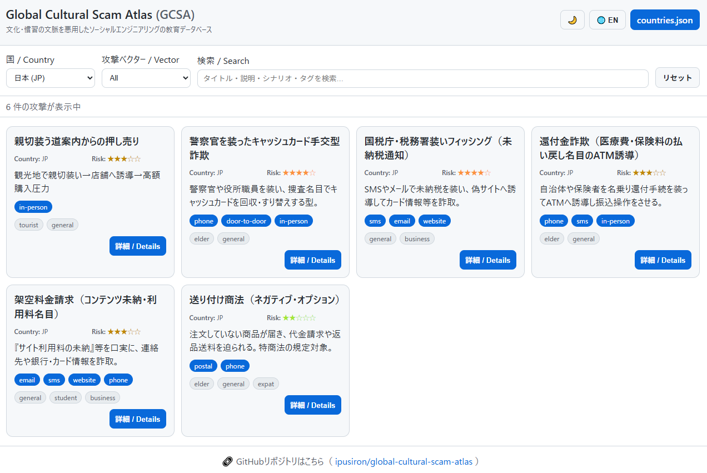

<!--
---
title: Global Cultural Scam Atlas (GCSA)
category: social-engineering
difficulty: 2
description: An educational, citation-driven database of scams that exploit cultural contexts across countries.
tags: [atlas, database, social-engineering, education, javascript]
demo: https://ipusiron.github.io/global-cultural-scam-atlas/
---
-->

# Global Cultural Scam Atlas (GCSA) - 文化文脈に基づく攻撃事例のデータベース


[](https://ipusiron.github.io/global-cultural-scam-atlas/)

**Global Cultural Scam Atlas(GCSA)** は、各国・地域で観測される **文化・慣習の文脈を悪用したソーシャルエンジニアリング** を、教育目的で整理する **オープンなデータベース** です。

特定の国民性を一般化する意図はなく、**「攻撃者がその傾向を悪用しうる」** という観点で事例を記述します。

### 本プロジェクトの特徴

**ツール自体はシンプル、データこそが価値**
本プロジェクトの本質は、各攻撃事例を構造化した **JSONデータベース** にあります。フロントエンドは軽量なHTML/CSS/JavaScriptで構成され、複雑なフレームワークは使用していません。

**GitHub + CIによる品質管理**
データベースをGitHub上で公開・管理するにあたり、継続的インテグレーション（CI）を活用することで品質を担保しています。このCI環境により、スキーマ検証・自動ビルド・デプロイが自動化され、やや複雑な構成となっていますが、データの正確性と一貫性を保つために不可欠な仕組みです。

---

## 🌐 デモページ

👉 **[https://ipusiron.github.io/global-cultural-scam-atlas/](https://ipusiron.github.io/global-cultural-scam-atlas/)**

ブラウザーで直接お試しいただけます。

### 主な機能

- **多言語対応**: 日本語/英語の切り替え（ボタン一つで全UI・データを切り替え）
- **テーマ切り替え**: ライト/ダークモード対応（システム設定を自動検出）
- **高度なフィルタリング**:
  - 国別フィルター
  - 攻撃ベクター別フィルター（in-person, phone, email, socialなど）
  - 全文検索（タイトル・説明・シナリオ・タグを横断検索）
  - フィルターリセット機能
- **視覚的なリスク表示**: 5段階のリスクスコアを色分け表示（★1〜5）
- **詳細モーダル**: 各攻撃の詳細情報（Cultural Lever、Scenario、Red Flags、Mitigations、Referencesなど）
- **レスポンシブデザイン**: デスクトップ・タブレット・スマートフォンに対応
- **アクセシビリティ**: キーボード操作対応、aria-label設定

---

## 📸 スクリーンショット

>
>*日本の攻撃を一覧表示*

---

## 🎯 目的
- 旅行者・生活者・教育機関・実務家が **Red Flags（兆候）** と **Mitigations（対策）** を素早く学べる。
- データは **一次情報（公的機関、CERT、学術）** を中心に継続更新。

## 💡 活用シナリオ

### 1. 海外旅行前の安全対策学習
**状況**: 日本人旅行者がアジア諸国へ2週間の旅行を計画している。

**活用方法**:
- 渡航先の国コードでフィルタリングし、その国で報告されている攻撃事例を一覧表示
- `attack_vector: in-person` でフィルタリングして、現地で遭遇しやすい対面型の詐欺を確認
- 各攻撃の「Red Flags（警告兆候）」をスマートフォンにメモし、現地で警戒すべきポイントを把握
- 「Mitigations（対策）」を事前に読み、断り方や対応フレーズを準備

**効果**: 事前知識により警戒心が高まり、詐欺被害のリスクを大幅に軽減。現地での判断力向上。

### 2. グローバル企業の社員研修教材
**状況**: 多国籍企業が海外赴任者向けのセキュリティ研修を実施。

**活用方法**:
- 赴任先国の攻撃事例データをAPIで取得し、社内研修システムに統合
- `risk_score >= 4` の高リスク攻撃を優先的に研修カリキュラムに組み込む
- `attack_vector: phone`, `email`, `social` など、リモートワーク環境で遭遇しやすい攻撃を重点的に解説
- 各国の「Cultural Lever（文化的レバー）」を理解することで、なぜその国でその手口が有効なのかを深く学習

**効果**: 実例ベースの研修により、従業員の危機意識が向上。文化的背景の理解により、現地での適応力も強化。

### 3. セキュリティ研究者のトレンド分析
**状況**: サイバーセキュリティ研究者が、ソーシャルエンジニアリングの地域別傾向を分析。

**活用方法**:
- `dist/countries.json` を定期的にダウンロードし、攻撃パターンの時系列変化を追跡
- `attack_vector`, `targets`, `tags` の出現頻度を分析し、地域ごとの攻撃手法の違いを可視化
- 複数国で共通する `cultural_lever` を抽出し、文化横断的な脆弱性を研究
- 新興の攻撃手法（新しい `tags` や `mediums`）を早期発見し、論文や警告レポートを執筆

**効果**: オープンデータを活用した研究により、学術的知見の蓄積と新たな防御策の提案が可能に。

## 📊 データ構造（概要）
- **1攻撃 = 1ファイル**（`data/attacks/{ISO2}/{id}.json`）
- ビルド時に **`dist/countries.json`** へ集約（ツール内配信用）
- スキーマ：`data/schema.json`

## 🔧 推奨方式（Recommended Approach）の採用理由
本リポジトリでは **「1攻撃=1ファイルで管理し、ビルド時に集約するハイブリッド運用」** を採用します。理由は以下です。

1. **並行編集に強い**：差分が小さく、PRレビューが攻撃単位で完結。衝突が減る。  
2. **トレーサビリティ向上**：出典・変更履歴・責任範囲を攻撃ファイルごとに明確化。  
3. **ローカライズ容易**：各ファイルに `ja`/`en` を内包し、翻訳粒度を制御。  
4. **配信効率**：編集は分割、公開は集約でクライアント負荷を最小化。  
5. **CIで品質担保**：スキーマ検証・語彙Lint・リンクチェックをファイル単位で実行し、不整合の流出を防止。

---

## 💻 データの利用方法（開発者向け）

本プロジェクトの集約データ **`dist/countries.json`** を利用して、独自のアプリケーションやツールを構築できます。APIキー不要で、誰でも自由にアクセス可能です。

### データの取得

公開されているJSONファイルを直接取得できます：

```javascript
const response = await fetch('https://ipusiron.github.io/global-cultural-scam-atlas/dist/countries.json');
const data = await response.json();
console.log(data);
```

### データ構造

```javascript
{
  "version": "1.0.0",
  "last_updated": "2025-01-15",
  "countries": [
    {
      "country_code": "JP",
      "country_name_local": "日本",
      "country_name_en": "Japan",
      "regions": ["APAC"],
      "language_codes": ["ja", "en"],
      "notes": "教育目的。一般化を意図しない注記。",
      "attacks": [
        {
          "id": "jp-001",
          "title": { "ja": "親切装う道案内からの押し売り", "en": "Good Samaritan Hard Sell" },
          "short_desc": { "ja": "観光地で親切装い→店舗へ誘導→高額購入圧力", "en": "..." },
          "cultural_lever": { "ja": "対立回避・断りづらさ", "en": "..." },
          "attack_vector": ["in-person"],
          "targets": ["tourist", "general"],
          "scenario": { "ja": "...", "en": "..." },
          "red_flags": { "ja": ["急かされる", "限定割引の強調"], "en": ["..."] },
          "mitigations": { "ja": ["即決しない", "正規案内所を利用"], "en": ["..."] },
          "risk_score": 3,
          "mediums": ["cash", "credit"],
          "legal_notes": { "ja": "", "en": "" },
          "references": [
            { "label": "参考記事", "url": "https://example.com" }
          ],
          "tags": ["tourism", "pressure-sales", "social-engineering"]
        }
      ]
    }
  ]
}
```

### 主要フィールド

| フィールド | 型 | 説明 |
|-----------|-----|------|
| `id` | String | 攻撃の一意識別子（例: `jp-001`） |
| `title` | Object | 攻撃の名称（多言語対応：`ja`, `en`） |
| `short_desc` | Object | 短い説明文（多言語対応） |
| `cultural_lever` | Object | 悪用される文化的傾向（多言語対応） |
| `attack_vector` | Array | 攻撃経路（`in-person`, `phone`, `email`, `sms`, `social`, `website`, `payment-app`, `postal`, `door-to-door`, `marketplace`） |
| `targets` | Array | 標的（`tourist`, `elderly`, `student`, `general`など） |
| `scenario` | Object | 攻撃の流れ（多言語対応） |
| `red_flags` | Object | 警告兆候のリスト（多言語対応） |
| `mitigations` | Object | 対策のリスト（多言語対応） |
| `risk_score` | Number | リスクスコア（1〜5、5が最高リスク） |
| `mediums` | Array | 決済手段（`cash`, `credit`, `bank-transfer`など） |
| `legal_notes` | Object | 法的注記（多言語対応、オプション） |
| `references` | Array | 参考文献・出典のリスト（`label`, `url`を含むオブジェクト配列） |
| `tags` | Array | タグ（`tourism`, `pressure-sales`, `social-engineering`, `scarcity`, `urgency`など） |

### 利用例

**特定の国の攻撃を取得：**
```javascript
const jpAttacks = data.countries.find(c => c.country_code === 'JP').attacks;
```

**リスクスコアでフィルタリング：**
```javascript
const highRisk = data.countries.flatMap(c => c.attacks)
  .filter(atk => atk.risk_score >= 4);
```

**attack_vectorで検索：**
```javascript
const phoneScams = data.countries.flatMap(c => c.attacks)
  .filter(atk => atk.attack_vector.includes('phone'));
```

### ライセンス

このデータはMITライセンスで公開されています。自由に利用・改変・再配布できますが、出典の明記を推奨します。

---

## ⚙️ データ生成とCI/CDの仕組み

**本プロジェクトの核心はデータです。** ツール自体は軽量なHTML/CSS/JavaScriptで構成されたシンプルな構造ですが、データベースをGitHub上で公開・管理するために、**CI（継続的インテグレーション）を活用した品質管理体制** を整えています。このCI環境が、やや複雑に見える構成の理由です。

本プロジェクトで公開される **`dist/countries.json`** は、リポジトリ内の個別攻撃データを自動で集約して生成しています。

ユーザーがアクセスするURL:

👉 **[https://ipusiron.github.io/global-cultural-scam-atlas/dist/countries.json](https://ipusiron.github.io/global-cultural-scam-atlas/dist/countries.json)**

### データからデプロイまでの流れ

1. **ソースデータ**
   - 各攻撃は **1ファイル単位**で管理されます（例: `data/attacks/JP/jp-001.json`, `data/attacks/US/us-001.json`）。

2. **ビルドスクリプト**
   - `tools/build-countries.mjs` が全攻撃ファイルを読み込み、国ごとにグルーピング。
   - メタ情報（`version`, `last_updated`, `countries[]`）を加えて **`dist/countries.json`** を生成します。

   抜粋:
   ```js
   const files = await glob("data/attacks/*/*.json");
   const grouped = {};
   // 国ごとにまとめて countries[] を構築
   const out = {
     version: "1.0.0",
     last_updated: today(),
     countries
   };
   await fs.writeFile("dist/countries.json", JSON.stringify(out, null, 2));
   ```

3. **package.jsonスクリプト**

	```js
	"scripts": {
  		"build:index": "node tools/build-index.mjs",
  		"build:countries": "node tools/build-countries.mjs",
		"build": "npm run build:index && npm run build:countries"
	}
	```
   - `npm run build` 実行で `dist/countries.json` が生成されます。

4. **CI/CD（GitHub Actions）**

   本プロジェクトでは、**データの品質担保と自動デプロイ** のために2つのワークフローを運用しています。

   **a. `.github/workflows/ci.yml`（品質チェック）**
   - PR作成時・`main`ブランチへのpush時に自動実行
   - `npm run build` でデータを集約
   - `npm run validate:schema` で `dist/countries.json` がスキーマに準拠しているか検証
   - これにより、不正なデータ形式やスキーマ違反を本番環境に流入させません

   **b. `.github/workflows/pages.yml`（自動デプロイ）**
   - `main` ブランチへのpush時に起動
   - ワークフローの中で `npm run build` が実行され、`dist/countries.json` が生成されます
   - 生成された `dist/countries.json` と `docs/index.html` などの静的資産を `public/` にコピーします
   - `peaceiris/actions-gh-pages` を用いて **`gh-pages` ブランチ**へ自動デプロイされます

5. **公開**

- GitHubの **Settings → Pages** にて、Sourceを `gh-pages / (root)` に設定します。  
- 数十秒後、GitHub Pagesにより自動的に公開されます。  
- 公開URL例:  
  - トップページ → [https://ipusiron.github.io/global-cultural-scam-atlas/](https://ipusiron.github.io/global-cultural-scam-atlas/)  
  - 集約データ → [https://ipusiron.github.io/global-cultural-scam-atlas/dist/countries.json](https://ipusiron.github.io/global-cultural-scam-atlas/dist/countries.json)  

### まとめ

本プロジェクトは、**シンプルなツール構造** と **堅牢なデータ管理** を両立させています。

- **ツール**: 軽量なHTML/CSS/JavaScript（フレームワークなし）
- **データ**: JSON形式で構造化された攻撃事例データベース（`data/attacks/{ISO2}/{id}.json`）
- **品質管理**: CIによるスキーマ検証（`.github/workflows/ci.yml`）
- **生成先**: `dist/countries.json`（ビルド時に自動集約）
- **公開ブランチ**: `gh-pages`
- **公開手段**: GitHub Actions + GitHub Pages（`.github/workflows/pages.yml`）

**CIを活用することで、データの正確性・一貫性を維持しながら、誰でも安心してデータを追加・更新できる環境を実現しています。**

### セキュリティ対策

GitHub Pagesで公開するにあたり、以下のセキュリティ対策を実装しています：

**1. Content Security Policy (CSP)**
- スクリプトとスタイルシートは同一オリジンのみ許可
- インラインスクリプトを禁止し、XSS攻撃を防止
- 外部リソースの読み込みを制限

**2. セキュアなHTTPヘッダー**
- `X-Frame-Options: DENY` - クリックジャッキング防止
- `X-Content-Type-Options: nosniff` - MIMEタイプスニッフィング防止
- `Referrer-Policy: no-referrer-when-downgrade` - リファラー情報の適切な制御
- `.htaccess` によるApache環境でのセキュリティヘッダー設定

**3. データ検証とサニタイゼーション**
- JSONデータの構造検証を実行時に実施
- すべてのユーザー表示データをHTMLエスケープ
- 外部リンクのURL検証（http/httpsのみ許可）
- `rel="noopener noreferrer"` による外部リンクの安全化

**4. 安全なデータ取得**
- `fetch` APIで `same-origin` モードを使用
- JSON.parse前のデータ検証

これらの対策により、静的サイトでありながら高いセキュリティレベルを維持しています。

---

## ⚠️ 免責

本データは教育目的であり、特定の国・文化・人々を一般化する意図はありません。出典は可能な限り一次情報を示し、リンク切れや更新は随時対応します。

---

## 📁 ディレクトリー構成

```
global-cultural-scam-atlas/
├── .github/
│   └── workflows/
│       ├── ci.yml              # 品質チェック（スキーマ検証）
│       └── pages.yml           # GitHub Pagesへの自動デプロイ
│
├── data/
│   ├── attacks/                # 攻撃事例データ（1攻撃=1ファイル）
│   │   ├── JP/                 # 日本の攻撃事例
│   │   │   ├── jp-001.json
│   │   │   ├── jp-002.json
│   │   │   └── ...
│   │   ├── US/                 # アメリカの攻撃事例
│   │   │   └── us-001.json
│   │   ├── IN/                 # インドの攻撃事例
│   │   │   └── in-001.json
│   │   └── ...                 # 他の国（追加予定）
│   │
│   ├── index.json              # 攻撃IDのインデックス（ビルド生成）
│   └── schema.json             # JSONスキーマ定義（draft-07）
│
├── docs/                       # 公開用静的サイト
│   ├── index.html              # メインページ
│   ├── style.css               # スタイルシート
│   ├── js/
│   │   └── main.js             # フロントエンドロジック
│   ├── .htaccess               # Apacheセキュリティヘッダー
│   └── content-guidelines.md   # コンテンツ編集ガイドライン
│
├── dist/                       # ビルド生成物（公開データ）
│   └── countries.json          # 集約された攻撃データベース
│
├── tools/                      # ビルドスクリプト
│   ├── build-index.mjs         # data/index.json 生成
│   └── build-countries.mjs     # dist/countries.json 生成
│
├── CLAUDE.md                   # Claude Code向けガイド
├── README.md                   # プロジェクト説明
├── LICENSE                     # MITライセンス
├── package.json                # npm設定・スクリプト定義
└── package-lock.json           # 依存関係ロック
```

### 主要ファイルの役割

| ファイル/ディレクトリ | 役割 |
|---------------------|------|
| `data/attacks/{ISO2}/{id}.json` | 個別の攻撃事例データ（編集対象） |
| `data/schema.json` | 攻撃データのJSON Schema定義（draft-07準拠） |
| `tools/build-index.mjs` | `data/index.json`を生成（国別攻撃IDインデックス） |
| `tools/build-countries.mjs` | 個別データを集約して`dist/countries.json`を生成 |
| `dist/countries.json` | API公開用の集約データ（自動生成） |
| `docs/index.html` | Webインターフェイス（多言語・テーマ切り替え対応） |
| `docs/style.css` | スタイルシート（ライト/ダークモード対応） |
| `docs/js/main.js` | フロントエンドロジック（検索・フィルタリング・i18n） |
| `docs/.htaccess` | Apacheセキュリティヘッダー設定 |
| `docs/content-guidelines.md` | コンテンツ編集ガイドライン |
| `.github/workflows/ci.yml` | PRとpush時のスキーマ検証 |
| `.github/workflows/pages.yml` | GitHub Pagesへの自動デプロイ |
| `CLAUDE.md` | Claude Code向け開発ガイド |

---

## 📄 ライセンス

MIT License – 詳細は [LICENSE](LICENSE) を参照してください。

---

## 🛠 このツールについて

本ツールは、「生成AIで作るセキュリティツール100」プロジェクトの一環として開発されました。
このプロジェクトでは、AIの支援を活用しながら、セキュリティに関連するさまざまなツールを100日間にわたり制作・公開していく取り組みを行っています。

プロジェクトの詳細や他のツールについては、以下のページをご覧ください。

🔗 [https://akademeia.info/?page_id=42163](https://akademeia.info/?page_id=42163)
