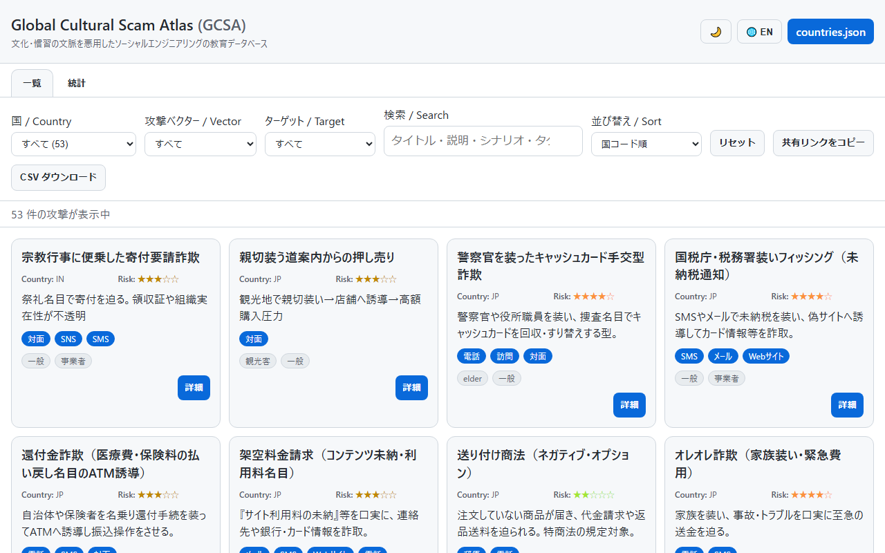

<!--
---
id: day082
slug: global-cultural-scam-atlas

title: "Global Cultural Scam Atlas (GCSA)"

subtitle_ja: "文化文脈に基づく攻撃事例のデータベース"
subtitle_en: "An educational database of scams exploiting cultural contexts"

description_ja: "各国・地域で観測される文化・慣習の文脈を悪用したソーシャルエンジニアリング事例を、1攻撃=1 JSONで管理し、CIで集約して公開する教育用データベース"
description_en: "An educational, citation-driven database of social engineering attacks that exploit cultural contexts across countries"

category_ja:
  - ソーシャルエンジニアリング
  - データベース
category_en:
  - Social Engineering
  - Database

difficulty: 4

tags:
  - atlas
  - database
  - social-engineering
  - education
  - javascript
  - json
  - i18n

repo_url: "https://github.com/ipusiron/global-cultural-scam-atlas"
demo_url: "https://ipusiron.github.io/global-cultural-scam-atlas/"

hub: true
---
-->

[English](README.en.md) · 日本語

# Global Cultural Scam Atlas (GCSA) - 文化文脈に基づく攻撃事例のデータベース


[](https://ipusiron.github.io/global-cultural-scam-atlas/)

**Day082 - 生成AIで作るセキュリティツール100**

**Global Cultural Scam Atlas (GCSA)** は、各国・地域で観測される文化・慣習の文脈を悪用したソーシャルエンジニアリング事例を教育目的で整理したオープンなデータベースです。特定の国民性を一般化する意図はなく、「攻撃者がその傾向を悪用しうる」という観点で事例を記述します。

1攻撃を1つのJSONファイルとして `data/attacks/{ISO2}/{id}.json` に蓄積し、GitHub Actionsで `dist/countries.json` に集約します。閲覧用のUIは依存ゼロのvanilla JSで、GitHub Pagesで配信します。

---

## 🌐 デモページ

👉 **[https://ipusiron.github.io/global-cultural-scam-atlas/](https://ipusiron.github.io/global-cultural-scam-atlas/)**

ブラウザーで直接お試しいただけます。

---

## 📸 スクリーンショット

> 
> *日本語・ライトテーマで初期表示（全67件、カード右上に出典確認バッジ）*

> 
> *jp-001 の詳細モーダル（Red Flags と Mitigations、References の publisher と accessed）*

> 
> *ダークテーマに切り替えた表示*

> 
> *統計タブ（国別・ベクター別・ターゲット別・リスク分布・出典確認状態の分布）*

---

## ✨ 特徴

- 1攻撃=1 JSONファイルで管理し、PR単位でレビューができる。
- JSON Schemaによる構造検証をCIで自動実行する。
- 日本語と英語の表示切替に対応し、UI文言とデータの両方が切り替わる。
- フィルター（国・攻撃ベクター・ターゲット・全文検索）と並び替え、フィルターリセットを提供する。
- 検索対象を `cultural_lever`・`red_flags`・`mitigations`・`id` にも広げ、どのフィールドで当たったかをカード上に示す。
- リスクスコア（1〜5）を色分けで示す。
- 絞り込み状態を URL ハッシュで共有できる（コピー用のボタンつき）。
- 統計タブで国別・ベクター別・ターゲット別・リスク分布を SVG で可視化する（全データと絞り込み後の2系列）。
- 絞り込み結果を CSV（UTF-8 BOM・CRLF・式インジェクション対策）で取り出せる。
- 事例ごとの出典確認状態（確認済み・一部確認・未確認）をカードと詳細モーダルにバッジで表示する。
- 「出典確認済みのみ」のチェックボックスで絞り込める（URL ハッシュ `verified=1` と往復する）。
- `tools/check-refs.mjs` で全 references のリンク生存を手動で検査できる（CI には入れない）。
- 外部APIやCDNに依存しない静的サイトとして動作する。
- データは `dist/countries.json` として誰でも取得できる。

---

## 📖 使い方

### 公開版をブラウザーで使う

デモページを開き、国・攻撃ベクター・ターゲット・検索語で絞り込みます。「出典確認済みのみ」のチェックボックスをオンにすると、`verification.status` が `verified` の事例だけが残ります。並び替えセレクトから「国コード順」「リスクが高い順」「ID 順」を選べます。カードには一致した検索フィールド（タイトル・シナリオ・Red Flags など）がチップで並び、右上に出典確認バッジ（出典確認済み／一部確認／未確認）が付きます。右上のボタンでテーマ（ライト/ダーク）と言語（JA/EN）を切り替えられます。カードの「詳細」ボタンを押すとモーダルで Red Flags・Mitigations・References（publisher と accessed）を確認でき、背景クリックや Esc で閉じるとフォーカスが元のボタンに戻ります。

### 一覧タブと統計タブ

上部のタブで「一覧」と「統計」を切り替えます。統計タブでは、国別・攻撃ベクター別・ターゲット別・リスクスコアの分布を、全データと現在の絞り込み結果の2系列で、依存ゼロの SVG 横棒グラフとして表示します。

### 共有リンクと URL ハッシュ

絞り込み・並び替え・言語の状態は URL ハッシュ（例 `#country=JP&vector=phone&target=elderly&q=ATM&sort=risk&lang=ja`）に保存され、ブラウザーの戻る・進むでも復元されます。「共有リンクをコピー」ボタンでクリップボードにコピーできます（Clipboard API が使えない環境ではダイアログで URL を提示します）。

### CSV ダウンロード

「CSV ダウンロード」ボタンで、現在の絞り込み結果を CSV（UTF-8 BOM 付き・CRLF 改行）で取り出せます。列は `id, country, title, vector, targets, risk, cultural_lever, red_flags, mitigations, verification, references` で、配列と references の URL 群は ` / ` で連結します。先頭が `= + - @` の値には `'` を前置して式インジェクションを無効化します。ファイル名は `gcsa-<国>-<日付>.csv` です。

### 出典の生存確認（手動実行）

`npm run check:refs` で、`data/attacks/**` の全 references の URL に対して HEAD（405 なら GET）をホスト毎 1 秒間隔で送り、表を出力します。4xx/5xx があれば終了コード 1 で終わります。外部依存で落ちるため CI には入れていません。

### Day081 と組み合わせる

Day081 の [Emotion-Based Scam Detector](https://ipusiron.github.io/emotion-based-scam-detector/) にシナリオを貼り、感情に訴える文面の判定を練習します。本リポジトリーからの直接リンクは、Day081 側が URL パラメーターで入力テキストを受け取っていないため今回は見送っています（詳しくは PR の本文を参照）。

### 新規事例の雛形スクリプト

```bash
node tools/new-attack.mjs JP        # 次の空き番号で data/attacks/JP/jp-033.json を生成
node tools/new-attack.mjs US 42     # us-042.json を生成（既存ファイルは上書きしない）
```

TODO 入りの雛形が生成されるので、人が内容を埋めてから `npm run build` と `npm run validate:schema` を通してください。

### URLで初期言語を指定する

`?lang=ja` または `?lang=en` を付けてアクセスすると、保存値やブラウザー設定より優先してその言語で表示します。URL ハッシュに `lang=` が含まれる場合はさらに優先されます。

### ローカルで動かす

依存を入れてビルドし、`docs/` をHTTPで配信します（`file://` では `fetch` が動かないためHTTP配信が必要です）。

```bash
npm install
npm run build:local        # dist/countries.json を docs/dist/ にコピー
python -m http.server 8000 --directory docs
# http://localhost:8000/ を開く
```

---

## 📐 画面構成

| 領域 | 役割 |
|------|------|
| ヘッダー | タイトル・テーマ切替・言語切替・countries.jsonダウンロードリンク |
| タブ | 「一覧」と「統計」の切り替え（`role="tablist"`、`aria-selected`） |
| フィルター | 国（件数つき）・攻撃ベクター・ターゲット・全文検索・並び替え・リセット・共有リンクをコピー・CSV ダウンロード |
| サマリー | 現在表示中の件数（`aria-live` で更新を通知） |
| カード一覧 | 攻撃ごとのカード（タイトル・国・リスク・ベクター・ターゲット・一致フィールド・詳細ボタン） |
| 統計 | 国別・ベクター別・ターゲット別・リスク分布の SVG 横棒グラフ（全データ／絞り込み後の2系列） |
| 詳細モーダル | ID・文化的レバー・シナリオ・Red Flags・Mitigations・References（背景クリックとEsc で閉じる、閉じた後は開いたボタンへフォーカス戻し） |
| トースト | 共有リンクのコピー結果を `aria-live` で通知 |
| フッター | GitHubリポジトリーへのリンク |

---

## 🎯 ユースケース

### 教育

- 情報リテラシーやセキュリティの授業で、国ごとの手口を並べて「権威・緊急性・互恵・同調」といった共通の心理が、文化の衣をまとって現れることを学ぶ。
- 比較文化や異文化コミュニケーションの授業で、「文化的レバー」の項目から各国の慣習を逆引きする。

### 仕事（セキュリティ以外）

- 海外赴任や出張者向けの研修で、行き先の国に絞って配布する。
- 旅行会社や留学エージェントが注意喚起資料の素材にする。
- カスタマーサポートが外国人の利用者から被害相談を受けたとき、手口を照合して説明する。
- 越境ECや国際送金の不正対策担当者が、国ごとの傾向を把握する。

### 暮らし・家庭

- 海外旅行の前に行き先の国を絞って読む。
- 留学する家族と共有する。
- 日本に来る外国人の友人に、日本の手口（JP）を英語表示で見せる。

### 趣味・創作

- ミステリーやサスペンスの創作で、現実味のある詐欺の筋書きを調べる。
- 脱出ゲームやボードゲームのシナリオ素材にする。
- データが日英併記なので、語学の対訳教材として読む。

### 研究・調べもの

- 攻撃ベクター × ターゲット × 文化的レバーで手口を類型化する。
- `countries.json` をそのまま分析ノートブックに読み込む。
- 事例の追加履歴を時系列で追い、流行の推移を見る。

### 組み合わせ

- Day081の [Emotion-Based Scam Detector](https://ipusiron.github.io/emotion-based-scam-detector/) に事例のシナリオ文を貼り、感情に訴える文面の判定を練習する。
- 共有リンクをコピーして授業や研修で配り、国・ベクター・ターゲットの絞り込みを再現してもらう。
- CSV ダウンロードを表計算や分析ノートブック（pandas・R など）に取り込み、国ごと・リスクごとの傾向を集計する。
- 統計タブで、全データと絞り込み後の分布を見比べ、国やターゲットの偏りを素早く把握する。
- 自分の事例をJSONで追加してPRを出し、データベースを育てる（`docs/content-guidelines.md` に従う）。`tools/new-attack.mjs` で雛形を作る。

### 限界

事例は執筆時点の観測であり、網羅ではありません。法的な助言ではありません。国民性の一般化には使わないでください（詳しくは `docs/content-guidelines.md` の方針を参照）。

---

## 📊 データ構造

- 1攻撃=1ファイル（`data/attacks/{ISO2}/{id}.json`）。
- ID形式は `^[a-z]{2}-\d{3}$`（例: `jp-001`）。
- ビルド時に `dist/countries.json` に集約する。
- 配布データの構造定義は `data/schema.json`（JSON Schema draft-07）。

### 主要フィールド

| フィールド | 型 | 説明 |
|-----------|-----|------|
| `id` | string | 攻撃の一意識別子（例: `jp-001`） |
| `title` | object | 攻撃の名称（`ja`, `en`） |
| `short_desc` | object | 短い説明文（`ja`, `en`） |
| `cultural_lever` | object | 悪用される文化的傾向（`ja`, `en`） |
| `attack_vector` | array | 攻撃経路（`in-person`, `phone`, `email`, `sms`, `social`, `website`, `payment-app`, `postal`, `door-to-door`, `marketplace`, `mixed`） |
| `targets` | array | 標的（`tourist`, `elderly`, `student`, `general`, `business`, `expat`） |
| `scenario` | object | 攻撃の流れ（`ja`, `en`） |
| `red_flags` | object | 警告兆候のリスト（`ja`, `en`） |
| `mitigations` | object | 対策のリスト（`ja`, `en`） |
| `risk_score` | integer | リスクスコア（1〜5） |
| `mediums` | array | 決済手段（`cash`, `credit`, `bank-transfer`, `cryptocurrency`, `gift-cards`, `e-wallet`, `qr-pay`） |
| `legal_notes` | object | 法的注記（`ja`, `en`、省略可） |
| `references` | array | 出典（`{label, url, publisher, accessed, quote}`、後者 3 項目は任意） |
| `tags` | array | タグ |
| `verification` | object | 出典確認状態（`{status, checked, note}`。`status` は `verified`／`partial`／`unverified`） |

### 現在の収録件数

| 国 | 件数 |
|----|------|
| JP（日本） | 32 |
| US（アメリカ） | 20 |
| GB（英国） | 7 |
| AU（オーストラリア） | 7 |
| IN（インド） | 1 |
| **合計** | **67** |

### 出典の確認状態

| 状態 | 件数 |
|------|------|
| verified（出典確認済み） | 53 |
| partial（一部確認） | 13 |
| unverified（未確認） | 1 |
| **合計** | **67** |

---

## 💻 データの利用方法

集約データ `dist/countries.json` は公開されており、APIキーなしで取得できます。

```javascript
const url = 'https://ipusiron.github.io/global-cultural-scam-atlas/dist/countries.json';
const data = await (await fetch(url)).json();
// 特定の国の攻撃を取得
const jp = data.countries.find(c => c.country_code === 'JP').attacks;
// リスクスコアで絞り込む
const highRisk = data.countries.flatMap(c => c.attacks).filter(a => a.risk_score >= 4);
// attack_vector で検索
const phoneScams = data.countries.flatMap(c => c.attacks)
  .filter(a => a.attack_vector.includes('phone'));
```

---

## ⚙️ データ生成とCI/CD

### ビルド

- `npm run build:index` で `data/index.json` を生成する。
- `npm run build:countries` で `dist/countries.json` を生成する。
- `npm run build` は両者をまとめて実行する。
- `npm run validate:schema` で `data/schema.json` に準拠しているか検証する。
- `npm run build:local` はビルド後に `dist/countries.json` を `docs/dist/` にコピーし、ローカルHTTPサーバーで配信できるようにする。
- `npm run check:refs` で全 references の URL の生存を HEAD／GET で確認する（手動実行、CI 不参加）。

### ワークフロー

| ファイル | 役割 |
|---------|------|
| `.github/workflows/ci.yml` | `main` へのpushとPRで `npm run build` と `npm run validate:schema` を実行する |
| `.github/workflows/test.yml` | `main` へのpushとPRで `npm test`（Node 22）を実行する |
| `.github/workflows/pages.yml` | `main` へのpushで `dist/countries.json` を含めてGitHub Pagesにデプロイする |

---

## 🧪 テスト

本リポジトリーは依存ゼロで `node --test` を実行します（Node 22以上）。

```bash
npm test
```

テストは以下を検証します。

- `test/core.test.js`: 絞り込み・リスクのクランプ・URLサニタイズ・HTMLエスケープ・ロケール解決・テーマ解決。
- `test/i18n.test.js`: `ja` と `en` のキー集合の一致、英語値に日本語文字が混入しないこと。
- `test/data.test.js`: 全攻撃JSONのID形式、ファイル名との一致、国ごとの件数、`risk_score` の範囲。
- `test/html.test.js`: `docs/index.html` のCSP・meta・favicon・noscript・id・module script・全角括弧の有無。
- `test/contrast.test.js`: ライト・ダーク両テーマで `(fg,bg)(fg,card)(muted,bg)(muted,card)(accent,bg)(accent,card)` の6組がWCAG 4.5:1以上であること。
- `test/format.test.js`: ファイルごとの最長行と最小行数。
- `test/readme.test.js`: このREADMEの構造・画像参照・禁止語・ディレクトリー構造の網羅。
- `test/phase2.test.js`: 検索フィールド拡張・ターゲット抽出・国別件数・並び替え・URL ハッシュの往復（`verified=1` 含む）・集計（`byVerification` を含む）・CSV エスケープと式インジェクション対策・CSV の verification/references 列・辞書 `labelFor()` を実データで検算。
- `test/new-attack.test.js`: `tools/new-attack.mjs` の採番・既存ファイルを上書きしない挙動・不正入力の拒否を一時ディレクトリーで検証（リポジトリーに生成物を残さない）。
- `test/check-refs.test.js`: `tools/check-refs.mjs` の URL 抽出関数と重複除去の単体テスト（ネットワークに出ない）。

GitHub Actionsの `test` ワークフローが `push` と `pull_request` で同じ `npm test` を実行します。

---

## 🔒 セキュリティ

本サイトは静的サイトとしてGitHub Pagesで配信します。GitHub Pagesは任意のレスポンスヘッダーを設定できないため、`X-Frame-Options` や `Strict-Transport-Security` などHTTPヘッダーで指定するセキュリティ対策はこのプロジェクトでは適用できません。実装している対策と、その制約は以下のとおりです。

実装している対策

- meta `Content-Security-Policy`: `default-src 'self'; script-src 'self'; style-src 'self'; img-src 'self' data:; font-src 'self'; connect-src 'self'; base-uri 'self'; form-action 'self'`。外部スクリプト・外部スタイル・外部フォント・外部fetchをすべて禁止する。
- すべてのユーザー表示値をHTMLエスケープする。外部リンクは `sanitizeUrl()` でhttp/httpsのみ許可する。
- 外部APIやCDNに接続しない。追跡タグも入れない。
- `rel="noopener noreferrer"` を外部リンクに付与する。
- referrerポリシーを `no-referrer` に設定する。

制約

- meta要素の `Content-Security-Policy` では `frame-ancestors` が無視される。クリックジャッキング対策をヘッダーで指定することはできない。
- meta `http-equiv="X-Frame-Options"` と `X-Content-Type-Options` はブラウザーが無視する（HTTPヘッダー専用）。本リポジトリーはこれらのmetaを置かない。
- `.htaccess` もGitHub Pagesでは解釈されない。本リポジトリーには置かない。

---

## ⚠️ 注意・免責

本データは教育目的であり、特定の国・文化・人々を一般化する意図はありません。法的・医療的助言ではありません。出典は可能な限り一次情報を示し、リンク切れや更新は随時対応します。

---

## 📁 ディレクトリー構造

```
global-cultural-scam-atlas/
├── .github/
│   └── workflows/
│       ├── ci.yml                       # ビルドとスキーマ検証
│       ├── pages.yml                    # GitHub Pages への自動デプロイ
│       └── test.yml                     # Node 22 で npm test を実行
├── .gitignore                           # 無視ファイル定義
├── assets/
│   ├── screenshot.png                   # 日本語ライトの初期表示
│   ├── screenshot2.png                  # 日本語ライトで詳細モーダル
│   ├── screenshot3.png                  # 日本語ダークの初期表示
│   ├── screenshot4.png                  # 日本語ライトで統計タブ
│   └── en/
│       └── screenshot.png               # 英語ライトの初期表示
├── CHANGELOG.md                         # 変更履歴（日英併記）
├── CLAUDE.md                            # Claude Code 向け開発ガイド
├── data/
│   ├── attacks/                         # 1攻撃=1 JSON のソースデータ
│   │   ├── AU/                          # 豪州の攻撃（7 件、au-001.json 〜 au-007.json）
│   │   │   ├── au-001.json
│   │   │   └── …
│   │   ├── GB/                          # 英国の攻撃（7 件、gb-001.json 〜 gb-007.json）
│   │   │   ├── gb-001.json
│   │   │   └── …
│   │   ├── IN/                          # インドの攻撃（1 件）
│   │   │   └── in-001.json
│   │   ├── JP/                          # 日本の攻撃（32 件、jp-001.json 〜 jp-032.json）
│   │   │   ├── jp-001.json
│   │   │   └── …
│   │   └── US/                          # 米国の攻撃（20 件、us-001.json 〜 us-020.json）
│   │       ├── us-001.json
│   │       └── …
│   ├── index.json                       # 攻撃IDのインデックス（ビルド生成）
│   └── schema.json                      # JSON Schema（draft-07、id 形式を pattern で固定）
├── docs/                                # GitHub Pages の公開ルート
│   ├── content-guidelines.md            # 事例を追加・編集するときの方針
│   ├── index.html                       # UI 本体（CSP・noscript・favicon を含む）
│   ├── js/
│   │   ├── gcsa-core.js                 # 純粋ロジック（テスト対象）
│   │   ├── gcsa-messages.js             # i18n 辞書（ja/en）
│   │   └── main.js                      # DOM 連結（ロード・絞り込み・描画）
│   └── style.css                        # スタイル（ライト/ダーク・レスポンシブ）
├── LICENSE                              # MIT ライセンス
├── package.json                         # npm スクリプト定義（test / build / build:local 等）
├── package-lock.json                    # 依存のロックファイル
├── README.en.md                         # 英語版 README
├── README.md                            # このファイル
├── test/
│   ├── contrast.test.js                 # WCAG コントラスト比の検証
│   ├── core.test.js                     # gcsa-core.js の単体テスト
│   ├── data.test.js                     # 攻撃 JSON の形式・件数検証
│   ├── format.test.js                   # 行長と最小行数の検証
│   ├── html.test.js                     # docs/index.html の構造検証
│   ├── i18n.test.js                     # ja/en 辞書の整合検証
│   ├── new-attack.test.js               # 雛形スクリプトを一時ディレクトリーで検証
│   ├── phase2.test.js                   # 検索拡張・並び替え・URL 状態・集計・CSV
│   ├── check-refs.test.js               # check-refs.mjs の URL 抽出関数の単体テスト
│   └── readme.test.js                   # README と README.en.md の構造検証
└── tools/
    ├── build-countries.mjs              # dist/countries.json を生成
    ├── build-index.mjs                  # data/index.json を生成
    ├── check-refs.mjs                   # references の URL 生存確認（手動実行）
    ├── copy-local.mjs                   # ローカル配信用に docs/dist/ へコピー
    └── new-attack.mjs                   # 新規事例の雛形 JSON を生成
```

---

## 💻 動作環境

- Node.js 22以上（`npm test` と各ビルドスクリプトで必要）。
- モダンブラウザー（Chromium系・Firefox・Safariの最新版）。
- 追加の依存はありません。ランタイム依存は0、`devDependencies` は `ajv` と `ajv-cli` と `glob` のみです。

---

## 📄 ライセンス

MIT License - 詳細は [LICENSE](LICENSE) を参照してください。

---

## 🛠️ このツールについて

本ツールは、「生成AIで作るセキュリティツール100」プロジェクトの一環として作成されました。このプロジェクトでは、AIの支援を活用しながら、セキュリティに関連するツールを100日間にわたり制作・公開していくチャレンジに取り組んでいます。プロジェクトの詳細や他のツールについては、以下のページをご覧ください。

🔗 [https://akademeia.info/?page_id=42163](https://akademeia.info/?page_id=42163)
